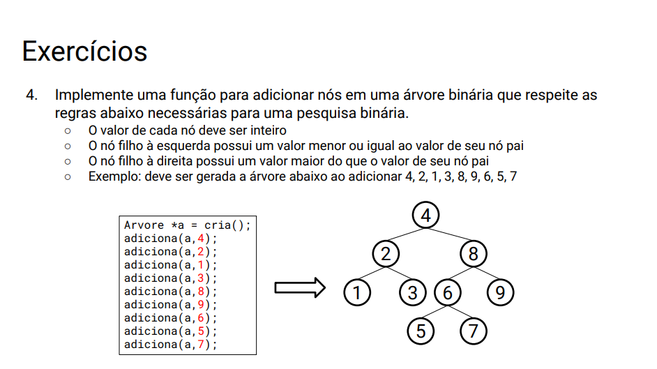

Para compilar no GCC e gerar o executável ```04```, use:

```gcc -Wall main.c arvore.c -o 04```

Passos do algoritmo para adição de nó:

1. Verificar se a árvore está vazia e, em caso positivo, inserir o novo valor no nó raiz.

2. Percorrer a estrutura a partir da raiz.

3. Se o nó atual tem valor igual àquele a ser inserido, retornar erro.

4. Se o valor a ser inserido for menor que aquele do nó atual, ir para a esquerda. Caso contrário, ir para a direita.

5. Se o próximo nó for nulo, inserir novo nó, caso contrário navegar para o próximo nó e repetir do passo 3.